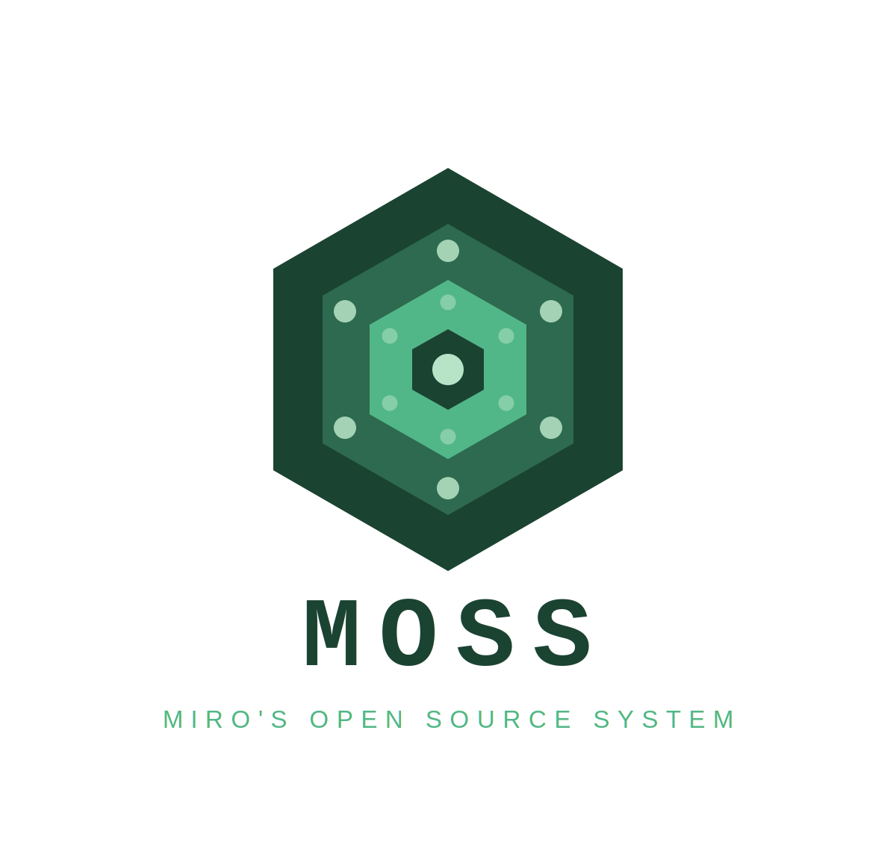

# MOSS (Miro's Open Source System) - A 32-bit UNIX-like operating system, built from scratch

Features:

- Monolithic kernel
- POSIX and UNIX compatibility
- Networking support
- ext2 filesystem
- Kernel and user space separation